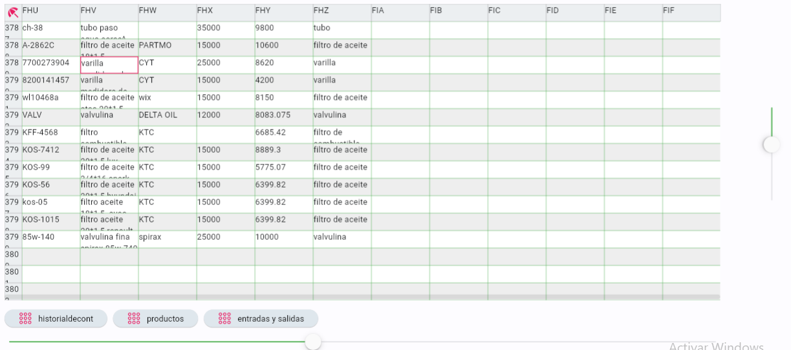

# FletSheet

## Introduction

FletSheet is a dynamic spreadsheet application crafted using the Flet framework, designed to offer an interactive data manipulation and calculation experience. This tool adeptly combines the simplicity of spreadsheets with the power of Python, allowing for intuitive cell-based data entry and manipulation.

## Features

1. **Scrollbar Navigation**: FletSheet boasts enhanced scrollbar functionality, enabling users to smoothly navigate through large tables both vertically and horizontally.
2. **Interactive Table Manipulation**: Users can effortlessly select and edit cells, navigate seamlessly using arrow keys, and input data directly via the keyboard. This feature has been refined to ensure that cell edits are accurately maintained across different sheet views and during scrolling.
3. **Intelligent Formula Evaluation**: The app supports an array of basic and complex formulas. Users can perform calculations such as `=B1*2+A5-4`, aggregate data using `=SUM(A1,A2,...)`, and even execute more elaborate functions like `=ADD(A1,5,A2,...)`.
4. **Real-Time Data Persistence**: Enhanced with the capability to retain user edits accurately, FletSheet ensures that data input and modifications are consistently preserved across various sheet sections, even after scrolling or switching sheets.
5. **Seamless Sheet Switching**: The app allows for easy toggling between different sheets, maintaining the integrity of user inputs and edits in each distinct sheet.

## Installation Guide

1. Clone the repository using the command:

`git clone https://github.com/jaluscg/FletSheet.git`

2. Install the required dependencies:

`pip install flet`

`pip install flet-route`

3. Launch FletSheet:

Open your terminal.
Navigate to the cloned directory.
Run python main.py to start the application.

Dive into the world of efficient data management and complex calculations with FletSheet, where simplicity meets functionality.

## Example:

